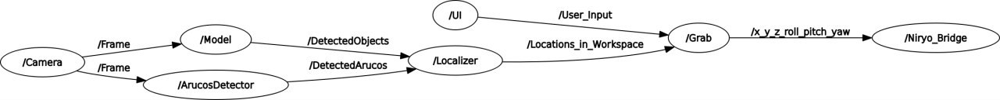

# 🦾 Niryo One — Robotic Dental Surgical Assistant

> A 6-axis robot arm that autonomously detects, localizes, and hands surgical tools to a dental surgeon on request — powered by YOLOv8, ROS 2, and computer vision.

---

## 🎯 Project Overview

This project repurposes the **Niryo One robotic arm** as an intelligent surgical assistant in a dental operating environment. Upon receiving a voice or UI command specifying a surgical tool, the system:

1. Detects and classifies the requested tool using a custom-trained **YOLOv8 Segmentation** model
2. Computes the tool's **position (x, y, z)** and **orientation (yaw)** from the segmented image
3. Plans a path to the tool and grasps it with the correct gripper angle
4. Delivers the tool to a pre-defined handoff position for the surgeon

The entire system runs in **ROS 2 Humble** on Ubuntu 22.04 and communicates with the robot over SSH.

---

## 🔬 Technical Pipeline

### 1. Vision — Tool Detection & Segmentation (`Camera.py`)
- A custom dataset of **10 surgical tool classes** was created with augmentations
- **YOLOv8 Segmentation** outputs both a classification label and a pixel-level segmentation mask per tool

### 2. Localization — Pose Extraction (`Localizer.py`, `detection.py`)
- **Center of Gravity** of the segmented mask → x, y pixel coordinates
- **PCA on segmentation contour** → tool orientation angle → gripper yaw
- **Depth (Z)**: fixed constant (0.125 m above table surface)
- **Interpolation** (`interpolation.py`): refines x/y estimates based on yaw calibration data

### 3. Grasping — Robot Control (`grab.py`)
- Subscribes to `/locations_in_workspace` topic for live tool pose data
- Connects to the Niryo One over **SSH** and sends pick commands
- Yaw angle is resolved into the correct gripper orientation to ensure clean grasps
- After grasping, the arm moves to the pre-defined surgeon handoff pose

---

## 🗺️ ROS 2 Node Graph



The system uses the following ROS 2 nodes:
- **Camera Node** — streams detections and publishes to `/camera_detections`
- **Localizer Node** — converts detections to workspace coordinates and publishes to `/locations_in_workspace`
- **Grab Node** — subscribes to locations, computes grasp parameters, and commands the robot

---

## 📁 Repository Structure

```
├── niryo_assistant/
│   ├── src/
│   │   ├── Camera.py           # YOLOv8 detection + ROS publisher
│   │   ├── Localizer.py        # Pixel → workspace coordinate conversion
│   │   ├── grab.py             # Grasp execution + SSH command dispatch
│   │   ├── detection.py        # Detection utilities
│   │   ├── interpolation.py    # Yaw-based position refinement
│   │   ├── frame.py            # Frame processing helpers
│   │   └── orientation.py      # PCA-based orientation estimation
│   ├── msg/
│   │   ├── CameraDetections.msg
│   │   └── Locations.msg
│   ├── config/ros_params.yaml
│   ├── CMakeLists.txt
│   └── package.xml
└── weights/
    └── best.pt                 # Trained YOLOv8 model weights
```

---

## 🚀 Getting Started

### Prerequisites
- Ubuntu 22.04
- ROS 2 Humble
- Python 3.10+
- Niryo One robot arm + Niryo ROS 2 stack

```bash
git clone https://github.com/Baher-Kherbek/Niryo-Arm-as-a-dental-surgeon-assistant.git
cd Niryo-Arm-as-a-dental-surgeon-assistant

pip install ultralytics numpy opencv-python paramiko

# Build the ROS 2 package
colcon build --packages-select niryo_assistant
source install/setup.bash

# Launch camera node
ros2 run niryo_assistant Camera

# Launch localizer
ros2 run niryo_assistant Localizer

# Trigger a grab (e.g. tool class 3)
ros2 run niryo_assistant grab 3
```

---

## 🛠️ Tech Stack


---

## 🙏 Acknowledgements

Special thanks to **Manara University** for providing access to the Niryo One robot arm and laboratory facilities.

---

## 👤 Author

**Baher Kherbek** — Robotics Engineer & AI Systems Developer  
[github.com/Baher-Kherbek](https://github.com/Baher-Kherbek)
